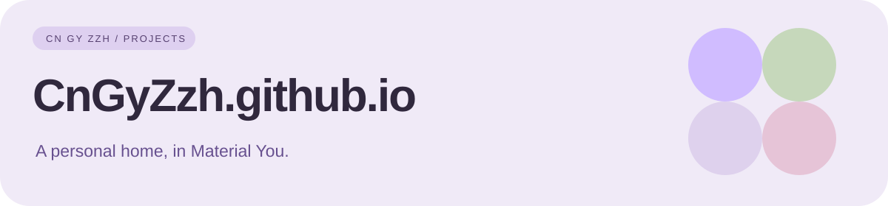

<div align="center">



# CnGyZzh.github.io

个人网站 · Material You · 原生 HTML / CSS / JavaScript

[访问网站](https://cngyzzh.github.io) · [项目区域](https://cngyzzh.github.io/#projects) · [反馈](https://github.com/CnGyZzh/CnGyZzh.github.io/issues)

</div>

## 网站内容

个人介绍、完整仓库索引、GitHub 项目数据、发布记录与活动归档入口。使用紫色主题、柔和圆角卡片和自适应宽屏布局。

## 交互与体验

- 深浅主题切换，保存本地偏好。
- 中英文主要内容切换；部分项目说明保留中文。
- 项目搜索与分类筛选。
- WeType Monet / Level 详情弹窗。
- 按需滚动入场、按钮按压与点击涟漪，尊重减少动态效果偏好。
- 从 GitHub 公开 API 读取 WeType Monet / Level 的数据与发布记录；失败时显示不可用提示。

## 本地预览

无需 npm 安装或构建。安装 Python 3 后，在仓库目录运行：

```sh
python -m http.server 8000 --bind 127.0.0.1
```

浏览器打开 http://127.0.0.1:8000 。该命令仅用于本地预览。

## 文件导航

| 文件 | 用途 |
| :--- | :--- |
| [index.html](index.html) | 页面结构、基础样式与交互脚本；GitHub Pages 首页入口。 |
| [material.css](material.css) | Material You 主题、自适应布局与动画覆盖样式。 |
| [index (1).html](index%20%281%29.html) | 仓库保留的另一份页面，不是首页入口。 |
| [assets](assets) | README 使用的仓库内 SVG 横幅。 |

## 维护说明

1. 项目增删时，同时更新项目卡片、搜索标签及项目计数。
2. 维护主要文案时，检查脚本中的 uiTranslations 和 data-zh / data-en 属性。
3. 发布前检查桌面 / 手机布局、搜索、主题、弹窗和键盘操作。
4. 推送到 main 后，由仓库现有 GitHub Pages 配置发布。

GitHub API 的匿名访问可能遇到限流；页面无需密钥，也不应将访问令牌写入前端。API 数据只反映公开信息，不代表完整贡献历史。

## 相关入口

[GitHub 主页](https://github.com/CnGyZzh/CnGyZzh) · [Level 活动归档](https://github.com/CnGyZzh/Level) · [所有仓库](https://github.com/CnGyZzh?tab=repositories)

仓库当前未声明单独的开源许可证。
